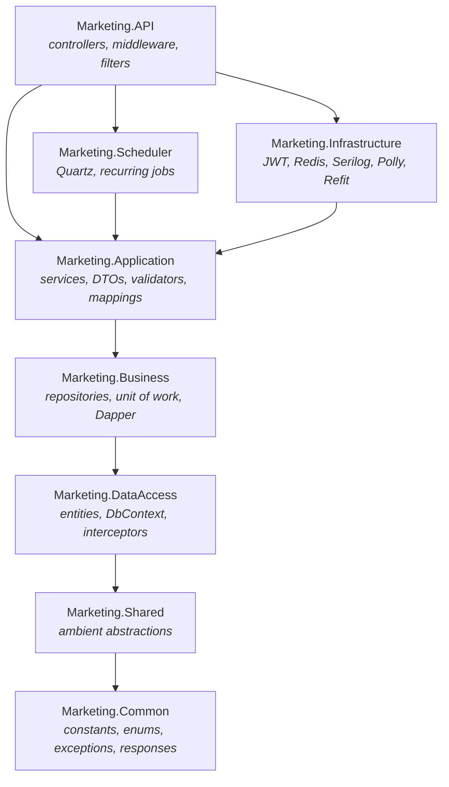
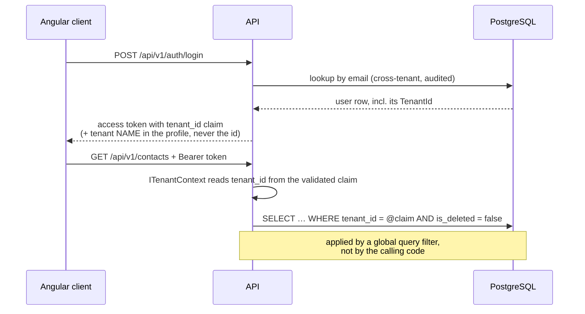

# Marketing Backend

Multi-tenant WhatsApp marketing SaaS API, built on the Meta WhatsApp Business Platform (Cloud API).

[](https://dotnet.microsoft.com/)
[](https://learn.microsoft.com/aspnet/core/)
[](https://www.postgresql.org/)
[](https://redis.io/)

---

## Contents

- [What this is](#what-this-is)
- [Architecture](#architecture)
- [Getting started](#getting-started)
- [Project layout](#project-layout)
- [How multi-tenancy works](#how-multi-tenancy-works)
- [Design decisions worth knowing](#design-decisions-worth-knowing)
- [Configuration](#configuration)
- [API surface](#api-surface)
- [Testing](#testing)
- [Database migrations](#database-migrations)
- [Roadmap](#roadmap)

---

## What this is

A production-grade ASP.NET Core API serving a multi-tenant marketing platform. Tenants connect
their own WhatsApp Business Account through Meta Embedded Signup, import contacts, build message
templates, and run campaigns against the Cloud API.

This repository currently contains the **foundation slice**: the solution skeleton, persistence
model, cross-cutting infrastructure, and authentication. Domain modules build on top of it.

| Area | Status |
| --- | --- |
| Solution, layering, build configuration | ✅ Complete — builds clean, 0 warnings |
| Entities, auditing, soft delete, concurrency, tenancy | ✅ Complete |
| Repositories, unit of work, Dapper reporting path | ✅ Complete |
| JWT auth, refresh rotation, roles and permissions | ✅ Complete |
| Redis cache, Serilog, Polly, rate limiting | ✅ Complete |
| Scheduler library with one-file job registration | ✅ Complete |
| Meta Cloud API transport client | 🟡 Client and error handling only |
| Tenants, Users, Contacts, Templates, Campaigns, Reports | ⬜ Not started |

### Stack

.NET 10 · ASP.NET Core 10 · EF Core 10 · PostgreSQL 17 · Dapper · Redis · Quartz.NET · Serilog ·
Refit · Polly · JWT · AutoMapper · FluentValidation · Swagger/OpenAPI · xUnit v3 · Testcontainers

---

## Architecture

Four layers, plus two dependency-free support projects. Each layer references only the layers
below it — the project graph enforces it, so a violation fails the build rather than a review.



The rules that keep the layering honest:

- **Controllers hold no business logic.** Bind, delegate to a service, shape the response.
- **Repositories hold no business rules.** They talk to the database and nothing else.
- **Services own** rules, transactions, integrations, caching, orchestration.
- **Entities never cross the API boundary.** Endpoints return DTOs, projected in the database.

`Marketing.Shared` exists so that `Infrastructure` can implement ambient abstractions
(`ICurrentUser`, `ITenantContext`, `ICacheService`, `ITokenService`) without referencing a layer
above it.

---

## Getting started

### Prerequisites

- [.NET 10 SDK](https://dotnet.microsoft.com/download)
- [Docker](https://www.docker.com/) — for PostgreSQL and Redis, and for the integration tests

### Run it

Start the infrastructure:

```bash
docker compose up -d
```

Run the API:

```bash
dotnet run --project src/Marketing.API
```

Then open **https://localhost:7108/swagger**.

On first run in Development the host applies migrations and seeds three system roles plus a
bootstrap platform administrator:

| Field | Development value |
| --- | --- |
| Email | `admin@marketing-platform.local` |
| Password | `ChangeMe!Development1` |

Sign in at `POST /api/v1/auth/login` to get a token pair, then use **Authorize** in Swagger.

> Migrations and seeding on startup are Development-only. In any shared environment they belong in
> a deployment step that runs once — not in every replica's startup, where they race.

---

## Project layout

```
Marketing_backend/
├─ Directory.Build.props            Target framework and analysis settings, declared once
├─ Directory.Packages.props         Every package version, pinned once (central package management)
├─ docker-compose.yml               PostgreSQL 17 + Redis 7
├─ src/
│  ├─ Marketing.Common/             Enums, constants, exception hierarchy, response envelopes
│  ├─ Marketing.Shared/             ICurrentUser, ITenantContext, ICacheService, ITokenService…
│  ├─ Marketing.DataAccess/         Entities, Fluent configurations, DbContext, interceptors, seed
│  ├─ Marketing.Business/           Generic + specific repositories, unit of work, Dapper executor
│  ├─ Marketing.Application/        Services, DTOs, FluentValidation validators, AutoMapper profiles
│  ├─ Marketing.Infrastructure/     Everything that talks outside the process
│  ├─ Marketing.Scheduler/          Quartz and every recurring job — see "Adding a scheduled job"
│  └─ Marketing.API/                Program, middleware, filters, controllers, DI extensions
└─ tests/
   ├─ Marketing.UnitTests/          Fast, no I/O
   └─ Marketing.IntegrationTests/   Real host, real PostgreSQL and Redis via Testcontainers
```

Upgrading the framework is one line in `Directory.Build.props`; upgrading a package is one line in
`Directory.Packages.props`. No `.csproj` carries a version number.

---

## How multi-tenancy works

This is the constraint everything else defers to.

**`TenantId` is resolved from the validated `tenant_id` JWT claim and from nowhere else.** It is
never read from a route, query string, header or request body, and never returned to a
tenant-scoped client.



The enforcement points:

| Mechanism | What it prevents |
| --- | --- |
| Global query filter on `ITenantScoped` entities | A forgotten `WHERE` clause leaking another tenant's rows |
| `IRequiresTenant` marker + interceptor guard | Writing an orphan row that no query can ever see |
| Interceptor blocks `TenantId` changes on update | A mass-assignment bug moving data across the boundary |
| `ISqlQueryExecutor` rejects SQL without `@TenantId` | Raw Dapper SQL bypassing the query filters |
| `RequireTenantId()` throws instead of returning null | A missing tenant silently widening a query |
| No tenant id in any response DTO | The client replaying or tampering with a tenant key |

`IgnoreQueryFilters()` appears in exactly three files — `UserRepository`, `RefreshTokenRepository`
and `DatabaseSeeder` — because sign-in, refresh and startup seeding all run *before* a tenant
exists. Each re-applies the soft-delete predicate by hand. `grep -rn IgnoreQueryFilters src` is
the audit.

---

## Adding a scheduled job

Jobs live in `Marketing.Scheduler` and are discovered by assembly scan. **Adding one is a single
file** — no DI registration, no list to update, and therefore no way to write a job that compiles
and silently never runs.

An email scheduler, end to end:

```csharp
[ScheduledJob(
    Key = "email-dispatch",              // stable: also the configuration key
    Group = "email",
    Cron = "0 */5 * * * ?",              // UTC, seconds-first, validated at startup
    Description = "Sends queued outbound email.")]
public sealed class EmailDispatchJob : ScheduledJobBase
{
    private readonly IEmailQueueService _emails;

    public EmailDispatchJob(IEmailQueueService emails, ILogger<EmailDispatchJob> logger)
        : base(logger) => _emails = emails;

    protected override Task ExecuteJobAsync(CancellationToken cancellationToken) =>
        _emails.DispatchPendingAsync(cancellationToken);
}
```

That is the whole change. The base class already handles timing, structured logging, cancellation
on shutdown, and wrapping failures so Quartz applies its retry policy instead of the job quietly
dropping off the schedule.

| Need | Do this |
| --- | --- |
| Work scoped to one tenant | Derive from `TenantScopedJobBase` and wrap in `ForTenantAsync` — the tenant query filters then apply exactly as on an HTTP request |
| Change a schedule in production | Set `Scheduler:Jobs:email-dispatch:Cron` — no deploy |
| Disable one job | `Scheduler:Jobs:email-dispatch:Enabled: false` |
| Stop all jobs but keep the API serving | `Scheduler:Enabled: false` |
| Allow overlapping runs | `AllowConcurrentExecution = true` — off by default, because two runs of a queue drainer send the same message twice |

Jobs call **Application services, never repositories**. The job is a trigger; the work belongs in a
service so it can be unit-tested without a scheduler and reused from an endpoint.

## Roles and permissions

Three roles, defined once in `Marketing.Common/Constants/Roles.cs`:

| Role | Scope |
| --- | --- |
| `SuperAdmin` | Operates the platform. The only role that crosses tenant boundaries |
| `Admin` | Administers one tenant: billing, users, WhatsApp connection, all tenant data |
| `Employee` | Operates campaigns, contacts and templates within one tenant |

Capability is expressed as **permissions** (`Permissions.cs`), not role names — `resource:action`
strings with wildcard grants, defaulted per role by `Permissions.ForRole()` and flattened into the
JWT at sign-in. `Employee` deliberately excludes user management, billing, contact export and
campaign dispatch: an employee builds the work, an admin approves anything irreversible or
involving bulk personal data.

Everything else constant — claim types, headers, policy names, rate-limit policies, cache keys,
defaults — plus **every enum** lives in `AppConstants.cs`. Add
`using static Marketing.Common.Constants.AppConstants;` to keep `UserStatus.Active` reading
normally.

> Role and permission strings are persisted and embedded in tokens. Never rename one; only add.

## Design decisions worth knowing

Choices that will look odd without the reason behind them.

<details>
<summary><b>Primary keys are version 7 GUIDs, not random ones</b></summary>

Random v4 GUIDs are a genuine problem as PostgreSQL B-tree keys: inserts land at random leaf pages,
fragmenting the index and inflating WAL traffic. Version 7 GUIDs embed a millisecond timestamp in
the high bits, so they sort by creation time and append at the right edge of the index the way a
sequence would — while staying globally unique, which matters when identifiers cross service
boundaries. See `SequentialGuid`.
</details>

<details>
<summary><b><code>RowVersion</code> is a <code>uint</code> mapped onto PostgreSQL's <code>xmin</code></b></summary>

PostgreSQL has no SQL Server–style `rowversion`. Every row already carries `xmin`, the id of the
transaction that last wrote it, which changes on every `UPDATE`. Mapping `RowVersion` onto it gives
optimistic concurrency with no extra column, no trigger and no storage cost.
`DbUpdateConcurrencyException` is translated to `ConcurrencyConflictException` inside the context,
so no upper layer has to reference EF Core to return a 409.
</details>

<details>
<summary><b>Audit columns are never assigned by application code</b></summary>

`AuditingSaveChangesInterceptor` owns `CreatedBy/On`, `ModifiedBy/On`, `DeletedBy/On`, `IsDeleted`
and `TenantId`. Anything writing through the `DbContext` — a controller, a background job, a future
bulk import — is audited identically, and there is no code path where someone can forget. Hard
deletes are rewritten into an `IsDeleted` update that touches only the delete columns, so flipping
the state can't resurrect stale in-memory values.
</details>

<details>
<summary><b>Every audited change writes its audit row in the same transaction</b></summary>

An audit trail written afterwards, or to a different store, can disagree with the data it describes
when a request fails midway. `AuditTrailInterceptor` writes to `audit_logs` inside the same
transaction — the change and its record commit together or not at all. Password hashes, security
stamps and token hashes are redacted from the payload, because an audit table that stores
credentials is a second, less-guarded credential store.
</details>

<details>
<summary><b>Redis is fail-open, and that is deliberate</b></summary>

A cache outage produces misses, never exceptions: reads fall through to PostgreSQL and writes are
discarded. After a failure the service pauses cache access for a cool-down window — otherwise every
request serially pays the connect timeout, which is slower than having no cache at all. The health
check reports `Degraded`, not `Unhealthy`, and is not a readiness dependency: losing the cache is a
latency problem, and taking instances out of rotation for it would make it an availability one.
</details>

<details>
<summary><b>Sign-in failures are deliberately indistinguishable</b></summary>

Wrong password, unknown address, disabled account and suspended tenant all return the same status
and the same message. An unknown address still pays for a full password-hash verification against a
decoy hash — without it the endpoint returns measurably faster for addresses that don't exist,
which is a user-enumeration oracle. Email addresses are unique platform-wide here, so that oracle
would be unusually valuable.
</details>

<details>
<summary><b>Refresh-token replay revokes every session, not just the request</b></summary>

Refresh tokens are single-use and rotate. Presenting one that has already been rotated means either
a buggy client or a stolen token; both are handled by tearing down the whole session chain for that
user. Only the SHA-256 hash is stored, so a database disclosure yields nothing usable. A rotating
`SecurityStamp` makes revocation take effect immediately rather than at access-token expiry.
</details>

<details>
<summary><b>Rate limiting is partitioned by tenant, not global</b></summary>

A single global bucket lets one customer's bulk import throttle every other customer — a
cross-tenant denial of service. Authentication is partitioned by client address (there is no
authenticated identity yet); everything else by tenant. The webhook policy is deliberately generous
because Meta retries aggressively and de-subscribes endpoints that stall.
</details>

<details>
<summary><b>Only transient failures are retried</b></summary>

The Polly pipeline runs total timeout → bulkhead → circuit breaker → retry → per-attempt timeout,
outermost first: the per-attempt timeout has to be innermost to bound each try, and the total
timeout outermost so retries plus backoff can't exceed the caller's budget. A 4xx from Meta means
the request itself is wrong — retrying it burns the tenant's rate-limit budget and can never
succeed. Backoff uses jitter so callers that failed during the same outage don't retry in lockstep.
</details>

<details>
<summary><b>Dapper for reporting, EF Core for everything else</b></summary>

Dashboards, aggregations, CTEs, window functions and exports go through `ISqlQueryExecutor`, which
shares the EF connection and transaction so a Dapper read inside a transaction sees the same
uncommitted state as the writes around it. Because raw SQL bypasses the global query filters, the
executor injects `@TenantId` itself and refuses any statement that doesn't reference it — and
refuses anything that isn't a `SELECT`/`WITH`, since writes must go through EF Core to be audited.
</details>

---

## Configuration

Secrets are never committed. `appsettings.json` ships them empty; supply them via user secrets
locally and the platform secret store elsewhere.

| Setting | Purpose |
| --- | --- |
| `Database:ConnectionString` | Npgsql connection string |
| `Authentication:Jwt:SigningKey` | HMAC-SHA256 key, minimum 32 bytes |
| `WhatsApp:AppSecret` | Meta app secret — Embedded Signup and webhook signatures |
| `Bootstrap:AdministratorPassword` | Initial platform administrator password |

```bash
dotnet user-secrets set "Authentication:Jwt:SigningKey" "<a-long-random-value>" --project src/Marketing.API
```

Options classes validate with data annotations and `ValidateOnStart()`, so a misconfigured host
fails at startup rather than on the first request that needs the value.

> `appsettings.Development.json` contains values pointing at the local `docker-compose` stack. They
> are intentionally worthless, protect nothing, and must not be reused anywhere shared.

---

## API surface

Base path `/api/v1/`. Responses are wrapped in a success envelope; failures are
[RFC 7807](https://datatracker.ietf.org/doc/html/rfc7807) problem documents.

| Method | Route | Auth | Purpose |
| --- | --- | --- | --- |
| `POST` | `/api/v1/auth/login` | Anonymous | Authenticate, open a session |
| `POST` | `/api/v1/auth/refresh` | Anonymous | Rotate the token pair |
| `POST` | `/api/v1/auth/logout` | Bearer | End one session |
| `POST` | `/api/v1/auth/logout-everywhere` | Bearer | End every session |
| `GET` | `/api/v1/auth/me` | Bearer | Signed-in user's profile |
| `GET` | `/health/live` | Anonymous | Liveness — no dependency checks |
| `GET` | `/health/ready` | Anonymous | Readiness — PostgreSQL |
| `GET` | `/health` | PlatformAdmin | Full dependency detail |

Errors carry a stable `errorCode`, a `correlationId`, and for server faults an `exceptionId` to
quote to support. Stack traces appear in Development only.

**Roles:** `PlatformAdmin` · `TenantOwner` · `TenantUser`

---

## Testing

```bash
dotnet test
```

**Unit tests** — no I/O. Cover the auditing interceptor (stamping, soft-delete rewrite,
cross-tenant reassignment refusal, mandatory-tenant guard), the password hasher including malformed
stored hashes, JWT issuance and validation, the cache's fail-open behaviour, the authentication
service (timing mitigation, lockout, replay revocation, stamp rotation) and paging/sorting.

**Integration tests** — spin up throwaway PostgreSQL and Redis containers via Testcontainers and
boot the real host. Real containers rather than in-memory doubles, because the behaviour worth
testing is exactly what a fake can't reproduce: partial unique indexes, the `xmin` concurrency
token, `jsonb` columns, and the global query filters as PostgreSQL actually applies them.

> Integration tests require a running Docker daemon.

---

## Database migrations

```bash
dotnet ef migrations add <Name> --project src/Marketing.DataAccess --startup-project src/Marketing.API
```

```bash
dotnet ef database update --project src/Marketing.DataAccess --startup-project src/Marketing.API
```

`DesignTimeDbContextFactory` reads `MARKETING_MIGRATIONS_CONNECTION` and falls back to the local
`docker-compose` instance.

---

## Roadmap

Domain modules, in the order they unblock each other:

- [ ] **Tenants & Users** — onboarding, invitations, role management
- [ ] **Contacts** — CSV import wizard, duplicate detection, bulk operations
- [ ] **Groups & Tags** — segmentation
- [ ] **WhatsApp connection** — Meta Embedded Signup, phone number and business profile sync
- [ ] **Templates** — synchronisation and review status tracking
- [ ] **Campaigns** — scheduling, dispatch, delivery and read receipts via webhook
- [ ] **Reports** — Dapper-backed dashboards and analytics
- [ ] **Admin portal** — tenant administration, audit log search, quotas, monitoring

### Known gaps in the foundation

- **No migration has been generated yet.** Run `dotnet ef migrations add InitialSchema` with
  PostgreSQL running.
- **AutoMapper's licence is an open decision.** Every release below 15.1.1 carries a high-severity
  advisory, and the last MIT release (14.0.0) falls inside that range — so there is no version that
  is both free and patched. The pin is 16.2.0, which is patched but commercially licensed (free
  below a revenue threshold). With one mapping profile in the solution, dropping the dependency is
  a realistic alternative. See the comment in `Directory.Packages.props`.
- **The Refit client has no per-tenant authorization handler.** Access tokens are per-tenant and
  encrypted at rest, so the handler lands with the WhatsApp connection module rather than being
  stubbed now.
- **Quartz uses the in-memory store.** Correct for a single instance; multi-instance deployment
  needs `AdoJobStore` with clustering enabled, or every replica fires every trigger.

---

## Contributing

`CLAUDE.md` holds the working contract for this repository — layering rules, the tenancy
invariants, and the section order every feature is delivered in. Read it before your first change.

Comments explain *why*, not *what*. A comment restating the code is noise; one recording a
trade-off or a rejected alternative is why the next person doesn't undo the decision.
